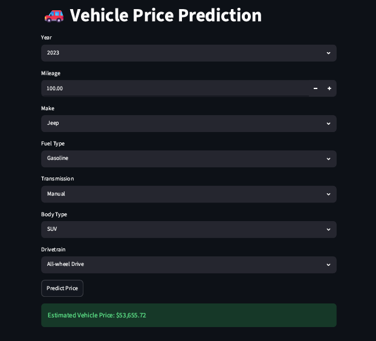

# Vehicle Price Prediction Model

This project uses Machine Learning to predict vehicle prices based on vehicle characteristics such as make, model, year, mileage, fuel type, transmission, body type, and drivetrain.The model was trained using Scikit-Learn and deployed using Streamlit to provide an interactive web application for vehicle price estimation.



## 🎯 Features

* Predict vehicle prices instantly
* Interactive web interface using Streamlit
* Supports multiple vehicle makes
* Considers mileage and manufacturing year
* Uses one-hot encoding for categorical features
* Real-time prediction results

  


## 📈 Machine Learning Workflow

1. Data Collection
2. Data Cleaning & Preprocessing
3. Feature Engineering
4. One-Hot Encoding
5. Model Training
6. Model Evaluation
7. Model Serialization using Joblib
8. Deployment using Streamlit


## 📂 Project Structure

```text
Vehicle-Price-Prediction-Model/
│
├── app.py
├── dataset.csv
├── vehicle_price_model.pkl
├── model_columns.pkl
├── VehiclePricePrediction.ipynb
├── requirements.txt
├── README.md
└── LICENSE
```

## 🚀 Installation

### Clone Repository

```bash
git clone https://github.com/malshiprabodha/Vehicle-Price-Prediction-Model.git
cd Vehicle-Price-Prediction-Model
```

### Install Dependencies

```bash
pip install -r requirements.txt
```

### Run Application

```bash
streamlit run app.py
```

## 🌐 Live Demo

```text
https://malshiprabodha-vehicle-price-prediction-model-app-l4agpv.streamlit.app/
```


